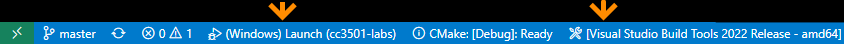

# Starter code for CC3501 labs

This is intended as a starting point for CC3501 students to build their own code for labs. The repository contains:

1. Preconfigured `CMakeLists.txt` that supports building embedded code for the target as well as native Windows code for a test harness.
2. Very minimal example for how to interact with WS2812 addressable LEDs (plus minimal example of native mock for testing purposes).

# Code organisation 

| Path                       | Description                                             |
| -------------------------- | ------------------------------------------------------- |
| `src`                      | Main program source code                                |
| `src/main.cpp`             | Main program entry point                                |
| `src/drivers`              | Hardware drivers                                        |
| `src/drivers/WS2812/`      | Low level driver for WS2812 using PIO                   |
| `src/drivers/logging/`     | Example basic log driver                                |
| `tests`                    | Code to support the native build for testing            |
| `tests/mocks/`             | Mock implementations of Pico SDK to enable native build |

# Setup instructions

## Pico toolchain
Download and install the official [RP2040 toolchain](https://github.com/raspberrypi/pico-setup-windows).

## Visual Studio Build Tools
For building the native Windows app for local debugging, install [Build Tools for Visual Studio 2022](https://visualstudio.microsoft.com/downloads/#build-tools-for-visual-studio-2022).

## Visual Studio Code 
You must run VS Code from the shortcut in the Raspberry Pico folder (which sets up the environment variables for you).

### Building for the embedded hardware

To build and debug on the embedded hardware, select a GCC cross-compiling kit from the list as the bottom of the VS Code window. You will also need to choose Cortex Debug as the launch target from the list at the bottom of the VS Code window.

### Building a native Windows app

To build and debug natively, select the Visual Studio Build Tools as the CMake kit. You will also need to choose (Windows) Launch as the launch target from the list at the bottom of the VS Code window.

The native Windows build allows you to test algorithms, math, etc in an easier development environment. Later, you will also be able to set up automated unit tests to validate parts of your code.

### Build instructions for both platforms 

The first time you build, you may need to manually trigger it. Use the CMake extension (left side of the VS Code window) to configure and then build the project. Make sure that the binaries are being produced.

The first time that you debug, you may need to use the Run and Debug panel (left side of the VS Code Window) to choose the launch target. These should be either Cortex Debug or (Windows) Launch. 

When switching kits, or on the first time, it is helpful to manually set the configuration. This is the Debug or Release build, chosen using the toolbar at the bottom of the window, between the launch config and the compiler kit.

# Credits
 * The `src/drivers/WS2812/WS2812.pio` file is an example for the RP2040 provided by the Raspberry Pi foundation, used under the terms of the BSD license. 

